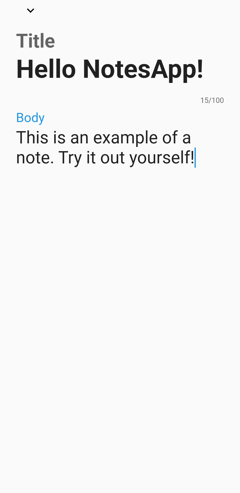
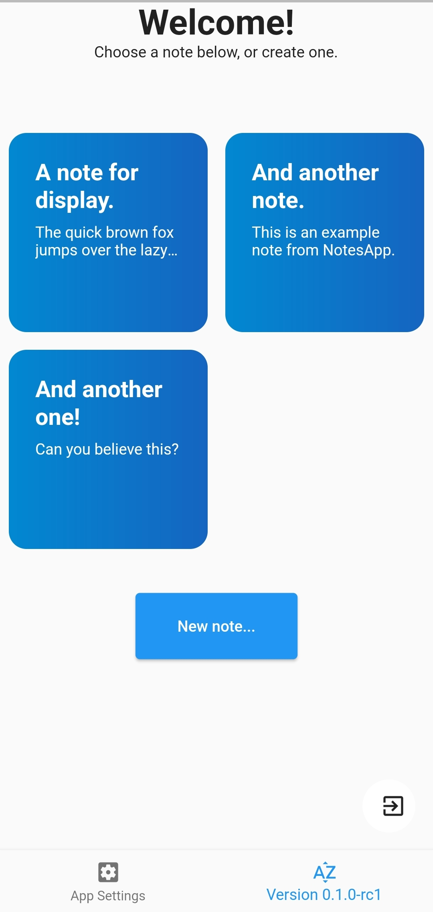

# NotesApp
NotesApp is a modern note taking application for Android/iOS (Partially supporting GNU/Linux) built using Flutter. It emphasizes on the speed and usability, while still remaining modern and simple. Currently NotesApp is still in development but can be used comfortably.

# Features
- [x] Very fast note loading from disk.
- [x] Intuitive, simple interface written using [Flutter](https://flutter.dev).
- [x] Works on all major platforms (But mainly targeted for Android).
- [x] Supports all the basic functionality you would need from a note app.
- [x] 100% free and open source.

# Screenshots

# License
NotesApp is licensed under the GNU GPLv3, you can find more information about the terms of use at the [LICENSE](./LICENSE) file.